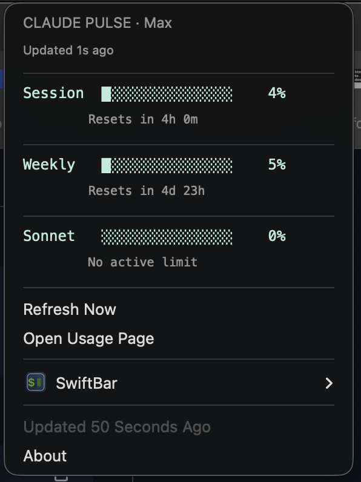

# Claude Pulse · macOS

A lightweight macOS menu bar monitor for your Claude subscription usage. Pure bash — no compilation, no Xcode, no Swift.


---

<p align="center">
  
</p>

## What It Does

Claude Pulse sits in your macOS menu bar and shows your Claude subscription utilization at a glance:

- **Session** — your current 5-hour session utilization with reset countdown
- **Weekly** — 7-day rolling usage across all models with reset countdown
- **Sonnet** — weekly Sonnet-specific usage with reset countdown
- **Plan badge** — shows your subscription tier (Free / Pro / Max 5x / Max 20x)
- **Color-coded** — green `#6ee7b7` under 50%, then yellow / orange / red as usage climbs
- **Auto-refreshing** — updates every 5 minutes, with a 60-second API cache to stay respectful
- **Refresh Now** — click to force an immediate update from the dropdown

Click the `◉` icon in your menu bar for the full dropdown with all three bars, reset times, and plan info.

### Color Thresholds

| Utilization | Color | Hex |
|-------------|-------|-----|
| 0–49% | 🟢 Green | `#6ee7b7` |
| 50–74% | 🟡 Yellow | `#FF9800` |
| 75–89% | 🟠 Orange | `#FF5722` |
| 90–100% | 🔴 Red | `#F44336` |

## Why This Exists

I wanted to see my Claude usage without opening a browser. Existing solutions are well-built native Swift apps — but I wanted something simpler. No Xcode. No compilation. No Gatekeeper prompts on unsigned binaries. Just a shell script you can read top to bottom in five minutes.

This is the opposite end of the spectrum: a ~300-line bash script that runs on [SwiftBar](https://swiftbar.app), uses `jq` for JSON parsing, and reads credentials from your existing Claude Code installation. If it breaks, you fix it in a text editor.

## Prerequisites

| Dependency | Why | Install |
|-----------|-----|--------|
| [Claude Code](https://docs.anthropic.com/en/docs/claude-code) | Provides the OAuth credentials (stored in macOS Keychain) | `npm install -g @anthropic-ai/claude-code`, then run `claude` and sign in |
| [SwiftBar](https://swiftbar.app) | Renders the menu bar plugin | `brew install --cask swiftbar` |
| [jq](https://jqlang.github.io/jq/) | Parses JSON responses | `brew install jq` |

> **You must have signed in to Claude Code at least once.** The script reads OAuth tokens from the macOS Keychain entry created by Claude Code.

## Install

```bash
git clone https://github.com/G-biggy/claude-pulse-mac.git
cd claude-pulse-mac
chmod +x install.sh
./install.sh
```

The installer checks for dependencies, symlinks the plugin into your SwiftBar plugins directory, and verifies that credentials are accessible.

If SwiftBar has never been opened on your machine, macOS will show a security dialog on first launch — click **Allow**.

Look for `◉` in your menu bar. That's it.

## Uninstall

```bash
./uninstall.sh
```

Removes the symlink from the SwiftBar plugins directory. Does not touch SwiftBar itself or your credentials.

## How It Works

1. Reads your Claude Code OAuth token from macOS Keychain
2. Calls Anthropic’s usage API
3. Caches the response for 60 seconds
4. Formats the data as a SwiftBar menu bar plugin
5. Auto-refreshes every 5 minutes
6. Auto-refreshes the OAuth token when it expires (~every 8 hours)

No tokens are stored outside of macOS Keychain. No data is sent anywhere except Anthropic’s API.

## API Details

Same as the [Android version](https://github.com/G-biggy/claude-pulse-android) — this script uses **undocumented** Anthropic endpoints:

**Usage data:**
```
GET https://api.anthropic.com/api/oauth/usage
Authorization: Bearer <access_token>
anthropic-beta: oauth-2025-04-20
```

**Token refresh:**
```
POST https://console.anthropic.com/v1/oauth/token
Content-Type: application/json

{
  "grant_type": "refresh_token",
  "refresh_token": "<refresh_token>",
  "client_id": "9d1c250a-e61b-44d9-88ed-5944d1962f5e"
}
```

The `client_id` is Claude Code’s official OAuth client ID.

> **These endpoints are undocumented and may change without notice.** If the API changes, the script will show an error state in the menu bar. Check this repo for updates.

## Configuration

Edit the top of `claude-pulse.5m.sh` to change:

| Variable | Default | What It Does |
|----------|---------|-------------|
| `CACHE_MAX_AGE` | `60` | Seconds between API calls |
| Filename `5m` suffix | `5m` | SwiftBar refresh interval (rename to `1m`, `10m`, etc.) |

## Project Structure

```
claude-pulse-mac/
├── claude-pulse.5m.sh   # The plugin script (this is the whole thing)
├── install.sh           # One-command installer
├── uninstall.sh         # Clean removal
├── LICENSE              # MIT
└── README.md
```

## Security Notes

- OAuth tokens are read from macOS Keychain — never stored in plain text files
- The token is never transmitted anywhere except directly to Anthropic’s servers over HTTPS
- No analytics, no tracking, no telemetry — the script talks to exactly one domain: `anthropic.com`
- API responses are cached locally at `/tmp/claude-pulse-cache.json` with a 60-second TTL

## Troubleshooting

**◉ shows a warning icon**
Make sure Claude Code is installed and you’re logged in: `claude login`

**"Token expired" persists**
The auto-refresh may have hit a rate limit. Run `claude login` in terminal to get a fresh token manually. After that, auto-refresh handles future expirations.

**Menu bar shows nothing**
Make sure SwiftBar is running and its plugins directory matches where the symlink was created. Check `~/Library/Application Support/SwiftBar/plugins/`.

**Token scope error**
```bash
security delete-generic-password -s "Claude Code-credentials"
# Quit all Claude Code instances, then restart Claude Code
```

## Acknowledgments

Companion project to [Claude Pulse · Android](https://github.com/G-biggy/claude-pulse-android).

Inspired by [Blimp-Labs/claude-usage-bar](https://github.com/Blimp-Labs/claude-usage-bar).

## Disclaimer

This project is not affiliated with, endorsed by, or officially supported by Anthropic. It uses undocumented API endpoints that may change at any time. Use at your own discretion.

## License

MIT — do whatever you want with it. See [LICENSE](LICENSE) for details.
